# Elevance DevOps CI/CD Project

## Project Overview

This project demonstrates a complete DevOps CI/CD pipeline using Terraform, Ansible, Docker, Jenkins, GitHub, and AWS EC2.

The infrastructure is provisioned using Terraform, the application environment is configured using Ansible, the application is containerized using Docker, and Jenkins automates the Continuous Integration and Continuous Deployment (CI/CD) process. The project is hosted on AWS EC2 and maintained using GitHub.

---

# Technologies Used

- AWS EC2
- Terraform
- Ansible
- Docker
- Jenkins
- GitHub
- Ubuntu Linux
- Docker Hub

---

# Project Structure

```
Elevance-CI-CD/
│
├── Ansible/
│   ├── Inventory
│   └── playbook.yml
│
├── Docker/
│   └── Dockerfile
│
├── Terraform/
│   ├── main.tf
│   ├── outputs.tf
│   ├── providers.tf
│   └── variables.tf
│
├── Images/
│   ├── 01_Project_Structure.png
│   ├── 02_Terraform_Init.png
│   ├── ...
│   └── 17_DockerHub.png
│
├── Documentation/
│   └── Elevance_Project_Report.pdf
│
├── Jenkinsfile
├── README.md
└── .gitignore
```

---

# Project Workflow

1. Infrastructure is provisioned using Terraform.
2. EC2 instance is created on AWS.
3. Docker and Jenkins are installed.
4. Ansible configures the server.
5. Source code is stored on GitHub.
6. Jenkins fetches the latest code.
7. Docker image is built.
8. Docker image is deployed.
9. Application becomes accessible through the EC2 Public IP.

---

# Screenshots

# 1. Project Structure

Overview of the project directory containing Terraform, Docker, Ansible, Jenkins, documentation, and application files.

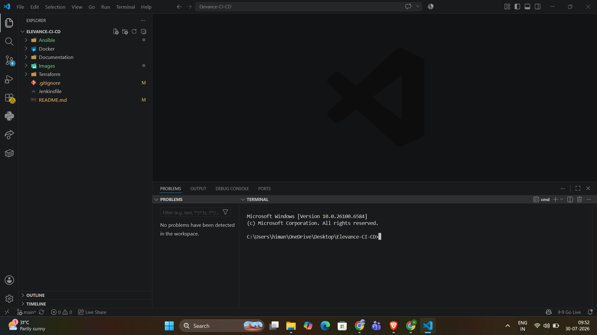

---

# 2. Terraform Initialization

Initialize Terraform and download the required provider plugins.

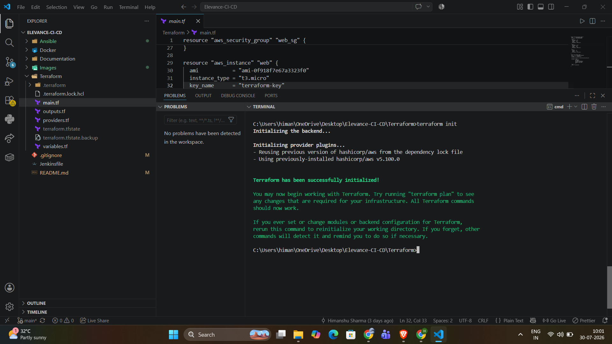

---

# 3. Terraform Execution Plan

Generate and review the infrastructure execution plan before provisioning resources.

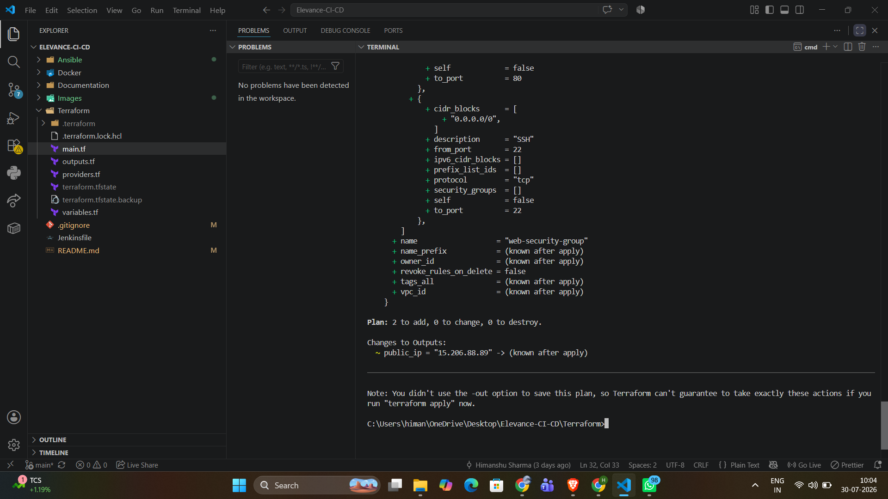

---

# 4. Terraform Apply

Provision AWS infrastructure using Terraform.

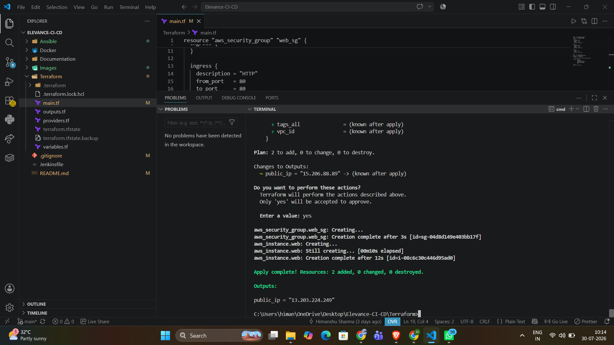

---

# 5. AWS EC2 Instance

Verify that the EC2 instance has been successfully created and is running.

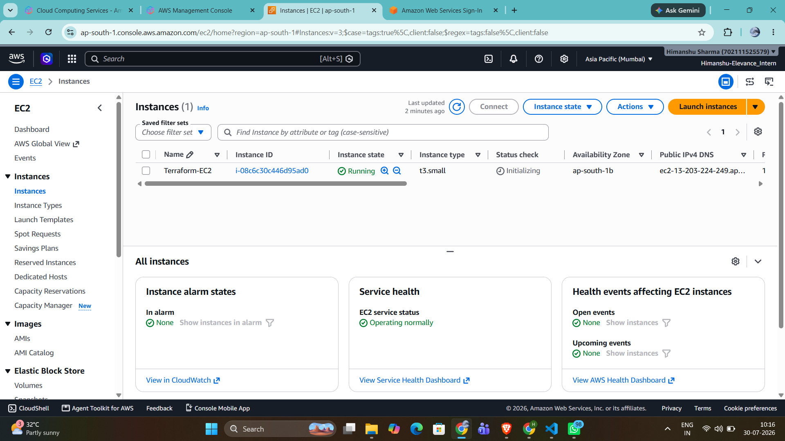

---

# 6. Security Group Configuration

Configure inbound and outbound rules for the EC2 instance.

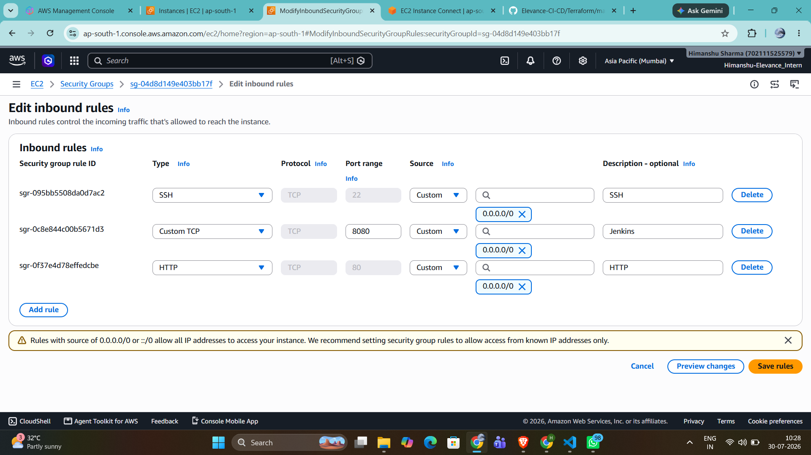

---

# 7. Connect to EC2 Instance

Connect to the EC2 instance using SSH.

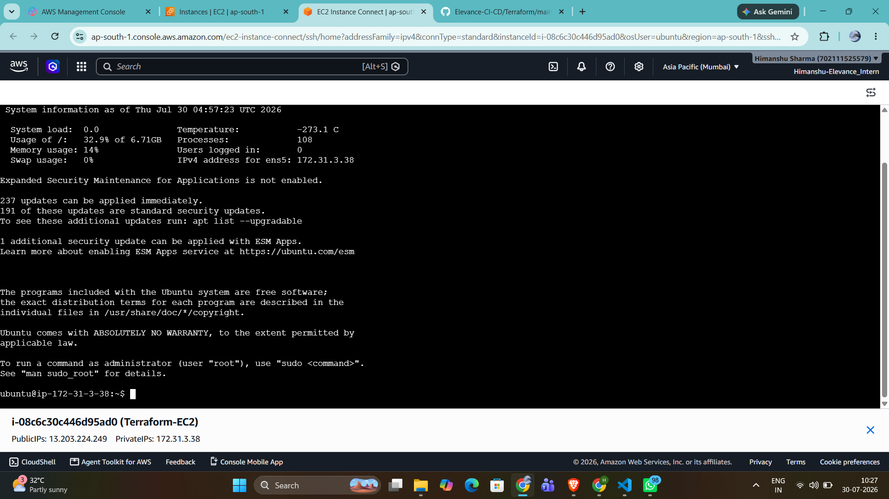

---

# 8. Docker Installation & Version Verification

Verify that Docker has been installed successfully.

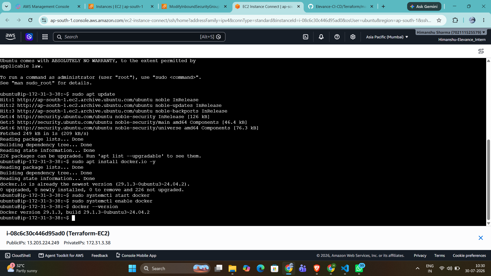

---

# 9. Jenkins Service Running

Verify that the Jenkins service is active and running.

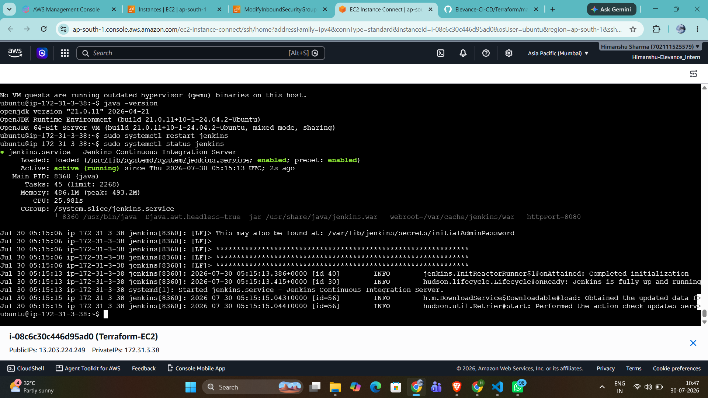

---

# 10. Jenkins Dashboard

Access the Jenkins web interface to create and manage CI/CD pipelines.

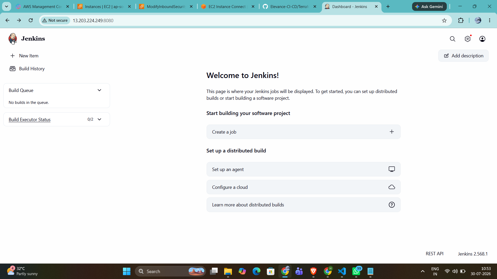

---

# 11. Pipeline Execution

Run the Jenkins pipeline and verify successful execution of all stages.

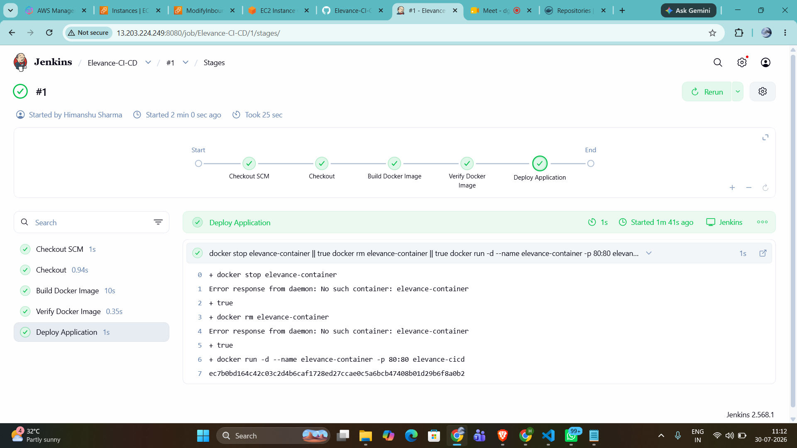

---

# 12. Pipeline Console Output

View the detailed execution logs generated by the Jenkins pipeline.

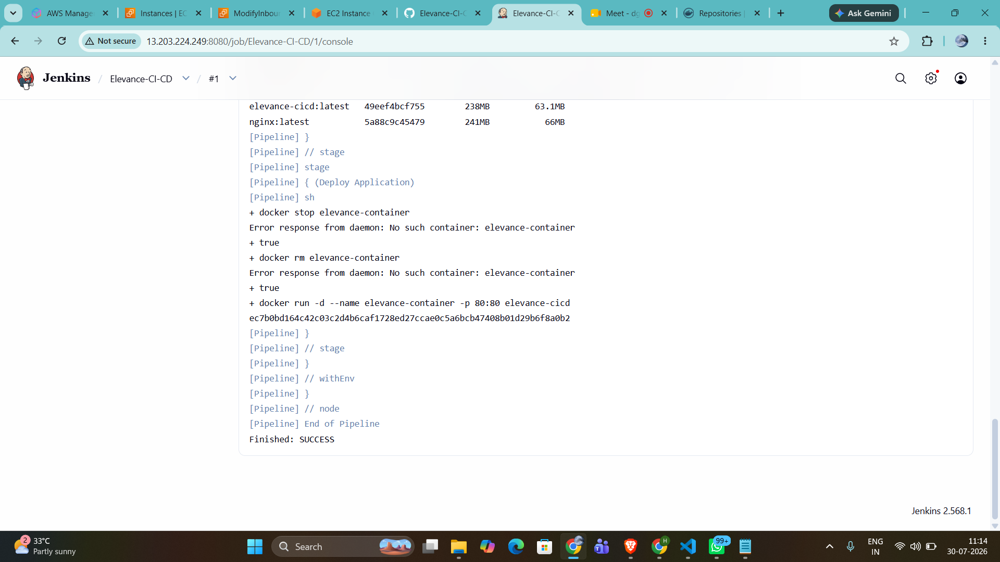

---

# 13. Docker Images

Verify that the Docker image has been built successfully.

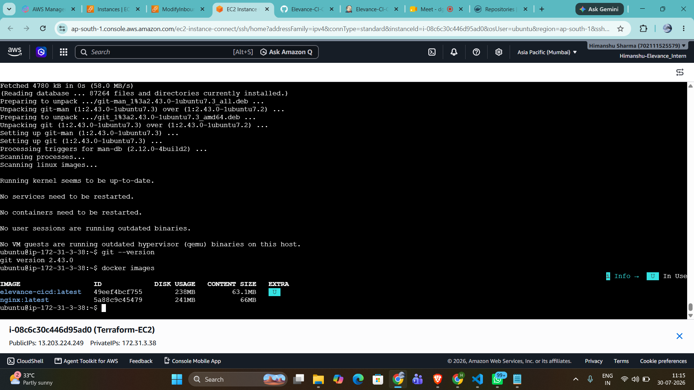

---

# 14. Running Docker Containers

Verify the running Docker containers using `docker ps`.

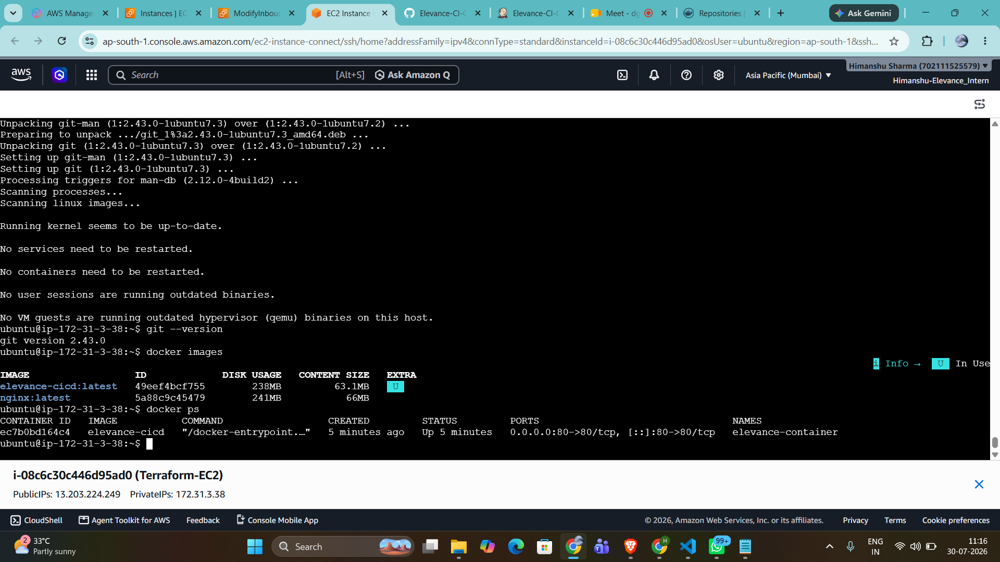

---

# 15. Website Deployment

Confirm that the application has been successfully deployed and is accessible through the browser.

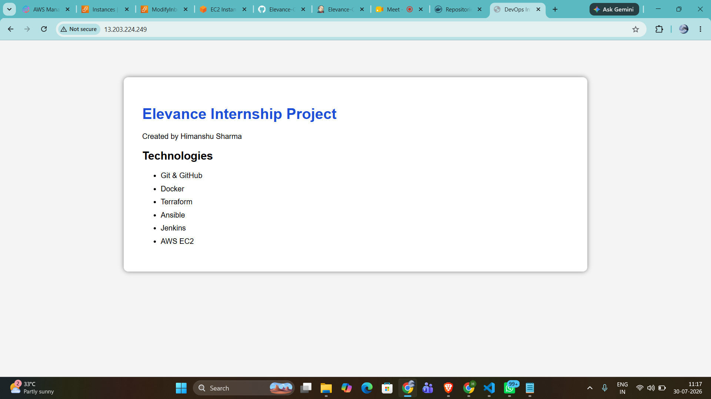

---

# 16. GitHub Repository

Source code repository containing the complete project.


---

# 17. Docker Hub Repository

Docker image successfully pushed to Docker Hub.

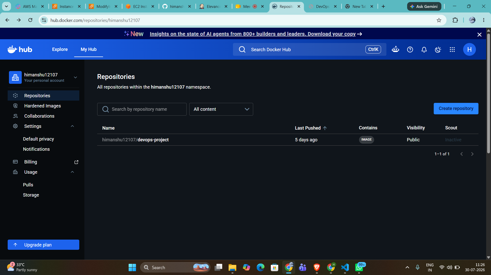

---

# CI/CD Pipeline

```
Developer
      │
      ▼
GitHub Repository
      │
      ▼
Jenkins Pipeline
      │
      ▼
Build Docker Image
      │
      ▼
Push Image (Docker Hub)
      │
      ▼
Deploy Container
      │
      ▼
AWS EC2 Instance
```


---

# Results

- Successfully provisioned AWS infrastructure using Terraform.
- Configured the server using Ansible.
- Automated Docker image creation using Jenkins.
- Implemented Continuous Integration using GitHub.
- Successfully deployed the application on AWS EC2.
- Verified the application through the EC2 Public IP.

---

# Learning Outcomes

- Infrastructure as Code (Terraform)
- Configuration Management (Ansible)
- Docker Containerization
- Jenkins CI/CD Pipeline
- GitHub Version Control
- AWS EC2 Deployment
- Docker Hub Integration

---

# Future Scope

- Kubernetes Deployment
- Auto Scaling
- Load Balancer Integration
- Monitoring using Prometheus and Grafana
- Blue-Green Deployment
- SSL/HTTPS Configuration

---

# Author

**Himanshu Sharma**

DevOps Internship Project

---

